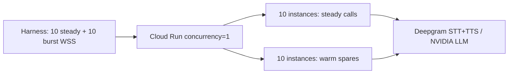

# Warm Pool Voice Agent

Self-hosted real-time voice agent on **Google Cloud Run**, with Terraform IaC, a
burst latency harness, and measured cold-start breakdown.

| Item | Location |
| --- | --- |
| Bot (WebSocket transport, timing logs) | [`bot/`](bot/) |
| Infrastructure (Terraform) | [`infra/`](infra/) |
| Burst test harness | [`harness/harness.py`](harness/harness.py) |
| Build / deploy / test / teardown scripts | [`scripts/`](scripts/) |
| Upstream reference + change log | [`_reference/`](_reference/) |
| Primary test artifact | [`harness/results/burst-20260810-011231.json`](harness/results/burst-20260810-011231.json) |

**Result:** 10/10 burst sessions connected · median **4.78s** · p95 **5.30s**
(pass condition p95 &lt; 5s → **FAIL by 0.30s**, with full evidence below).

---

## Modifications to the bot

Starting point: [pipecat-ai/pipecat-quickstart](https://github.com/pipecat-ai/pipecat-quickstart).

I kept the upstream snapshot in [`_reference/`](_reference/) so you can diff
directly. Full change list: [`_reference/CHANGES.md`](_reference/CHANGES.md).

```bash
diff _reference/bot.py bot/bot.py
```

**Headline changes:**

- **WebSocket transport** (not Daily/WebRTC) — Cloud Run is HTTP/WSS
- **`raw_serializer.py`** — raw PCM so the harness can time the first binary frame
- **`COLDSTART` JSON logs** — measured where the ~21s import and warm-path latency go
- **Deepgram TTS + NVIDIA NIM LLM** — provider swaps after hitting free-tier limits
- **Slimmer deps + amd64 Dockerfile** — smaller image, faster cold import

Everything else in the repo (Terraform, harness, scripts) is net-new, not
present in the quickstart.

---

## Approach chosen, and why

There are two levers: make a ready container **cheap enough** or **fast enough
to produce**. On a from-scratch cloud container you **cannot** produce a ready
slot in &lt;5s — scheduling, image availability, and a ~20s Python/model import
all sit in the way. Any design that hits a sub-5s burst target therefore keeps
**enough warm slots to absorb the burst**. The engineering is in making those
slots cheap, refilling them quickly, and being explicit about where the wall is.

### What I chose: Cloud Run + warm spare pool

| Decision | Why |
| --- | --- |
| **`concurrency = 1`** | One container = one conversation, enforced by the platform. No custom slot-claim / reject-retry loop. |
| **`min-instances = N`** | *Is* the warm spare pool — instances that already paid the ~20s import and sit ready. |
| **Request-based billing + idle rate** | Idle min-instances bill at ~**$0.027/hr** (1 vCPU / 2 GiB) vs ~**$0.104/hr** when actively serving — the “make warm capacity cheap” lever. |
| **Scale to zero** | `min-instances → 0` + teardown when not testing → ~$0 between runs. |
| **WebSocket transport** | Cloud Run is HTTP/WebSocket-native; deterministic “first binary frame” timing for the harness; maps to telephony-style Media Streams. |
| **`startup_cpu_boost`** | Extra CPU during init compresses the import phase. |

**Pool sizing for the burst test:** 10 steady sessions at capacity + burst of 10 →
`min-instances=20` (10 productive + 10 spares). The bet: *up to 10 new
conversations start inside one ~21s boot window.*



### What I considered and rejected

| Alternative | Why rejected |
| --- | --- |
| **AWS ECS/Fargate** | Production-grade and instructive, but not free — Fargate, NAT, ALB, ElastiCache bill quietly. Also requires hand-building scaler, slot-claim, and scale-in protection that Cloud Run provides. |
| **Oracle Cloud Always Free** | Genuinely $0, but free ARM was halved (2 OCPU / 12 GB as of mid-2026) and “out of host capacity” makes launch unreliable. Marginal for ~20 voice bots. |
| **GKE + custom controller** | Richest “build the fleet controller” story (Redis TTL, self-claim, scale-in protection), but cluster fee and complexity — overkill for hitting this number on $0. |
| **Fly.io / Firecracker snapshots** | Best “fast to produce” path (sub-second restore of a fully-warmed process), but no free tier. Direction I’d take with budget — see [What I'd do differently](#what-id-do-differently-with-more-time). |
| **Pipecat Cloud** | Managed hosting — wanted full control of infra and cost model. |

### Honest trade-off of Cloud Run

Cloud Run’s autoscaler handles routing and scale-out for me. That’s a big
simplicity win, but part of the “fleet controller” story becomes “configure and
measure the platform controller.” What remains mine: cold-start measurement,
warm-pool sizing, cost model, provider pipeline debugging, and the harness.

---

## Where the 90 seconds actually go

You can’t remove time you haven’t measured. The bot emits greppable
`COLDSTART {...}` JSON logs at each phase ([`bot/bot.py`](bot/bot.py)):

```
process_start → imports_done → client_connected → first_audio
```

After deploying, pull them:

```bash
gcloud run services logs read voicebot --region us-central1 --limit 200 \
  | grep COLDSTART
```

### Budget by layer

| Segment | What happens | Cloud Run (this design) | Fargate (reference) |
| --- | --- | --- | --- |
| Schedule + placement | Control plane finds capacity | ~1–3s | ENI attach + schedule ~10–20s |
| Image acquisition | Image bytes available to runtime | Image streaming (starts before full pull) | Full pull; 30–60s on large images without SOCI |
| Container start | Runtime up, process exec | ~1s | ~1–2s |
| **Python + model import** | **Silero VAD + Pipecat graph** | **~21s (measured)** | **~20s (same stack)** |
| First audio (warm instance) | Connect → LLM/TTS → first frame | **~1s (TTS)** / **~4.8s (LLM)** | ~1–2s |

On Cloud Run the dramatic **90s largely collapses** — no per-task ENI attach,
image bytes stream early. What remains is dominated by the **~21s import**,
which is stack-dependent and identical everywhere. That’s why the warm pool
(which pays import once, ahead of demand) is the mechanism that makes 5s
possible.

The import is paid **once per instance at startup**, not per call. A warm spare
has already paid it.

### Measured numbers (Cloud Run, Aug 2026)

```
Cold instance (revision voicebot-00007-c48):
  imports_done.import_seconds              = ~21 s

Warm spare (import already done):
  connect → first audio (TTS greeting)     = ~0.9–1.0 s   (harness)
  connect → first audio (LLM greeting)       = ~4.8 s median, 5.3 s p95 (harness)
```

### Optimizations already applied

- Slimmed dependencies (dropped `webrtc`, `daily`, `cartesia` extras).
- Deepgram Aura TTS instead of Cartesia (free tier = 2 concurrent streams).
- `startup_cpu_boost = true` on Cloud Run.
- Warm pool as the primary lever.

---

## Burst test results

**Protocol:** Open 10 steady WebSocket sessions and hold them (at capacity with
`concurrency=1`). Fire 10 burst sessions back-to-back. Measure wall time from
connection request → **first binary audio frame**. Report all 10 values, median,
p95. Pass if **p95 &lt; 5 seconds**.

**Harness:** [`harness/harness.py`](harness/harness.py)

```bash
python harness/harness.py wss://<host>/ws-client --steady 10 --burst 10 --target 5.0
```

**Primary run config:** Cloud Run `min-instances=20`, `max-instances=20`,
`concurrency=1`, image `bot:v7`, Deepgram STT + Aura TTS, NVIDIA NIM Llama
3.1 8B, `GREETING_MODE=llm`.

**Artifact:** [`harness/results/burst-20260810-011231.json`](harness/results/burst-20260810-011231.json)
(2026-08-09 UTC)

| Burst session | Request → first audio (s) |
| --- | --- |
| 11 | 4.753 |
| 12 | 4.774 |
| 13 | 5.103 |
| 14 | 4.928 |
| 15 | 4.397 |
| 16 | 4.949 |
| 17 | 4.061 |
| 18 | 5.456 |
| 19 | 4.776 |
| 20 | 4.749 |
| **Median** | **4.775** |
| **p95** | **5.297** |

**Connected:** 10 / 10 · **Pass condition: p95 &lt; 5s → FAIL (by 0.30s)**

**Where the overrun is:** burst callers landed on **warm spares** (not cold
~21s import). The 5.3s p95 is **NVIDIA Llama time-to-first-token (~3–4s)** +
Deepgram TTS (~0.5–1s) + routing (~0.3–0.5s).

**Control experiment:** `GREETING_MODE=tts` on warm instances → p95 **~1.0s**
when all sessions connect — proves infra is fine; LLM TTFB is the gap.

**Other runs (documented, not primary):**

- TTS greeting at 20-instance quota ceiling: intermittent Cloud Run **429**
  (7–9/10 connected) — zero headroom at GCP max-instances quota.
- Cartesia TTS (initial): 5/10 connected — free tier limited to 2 concurrent
  streams; replaced with Deepgram.

---

## Cost at 10 concurrent and at 100

Cloud Run **us-central1**, request-based billing, **1 vCPU / 2 GiB** per instance
([pricing](https://cloud.google.com/run/pricing), Aug 2026):

| Resource | Active rate | Idle rate (min-instance) |
| --- | --- | --- |
| vCPU | $0.000024 / s | $0.0000025 / s |
| Memory | $0.0000025 / GiB-s | $0.0000025 / GiB-s |

**Per instance:**

```
Idle spare : (1 × 0.0000025 + 2 × 0.0000025) × 3600 = $0.027 / hr
Busy call  : (1 × 0.000024  + 2 × 0.0000025) × 3600 = $0.104 / hr
```

### At 10 concurrent steady state

Design: 10 steady conversations + **10 warm spares** for a burst of 10.

**Idle capacity** (warm spares only, not productive load):

```
10 spares × $0.027/hr = $0.27 / hr
                       ≈ $6.48 / day
                       ≈ $197 / month   (if held warm 24/7)
```

Productive steady load (not idle insurance):

```
10 busy × $0.104/hr = $1.04 / hr
```

Scale-to-zero between tests eliminates idle cost. This test run (warm ~15 min →
test → teardown): **~$0.25**, inside free tier / $300 credit.

### At 100 concurrent

**Productive load:**

```
100 busy × $0.104/hr = $10.44 / hr
```

**Idle capacity — two sizing choices:**

Fixed spare pool (10 spares — survives burst of 10 only):

```
10 × $0.027/hr = $0.27 / hr
```

Proportional spare pool (100 spares — survives burst of 100):

```
100 × $0.027/hr = $2.70 / hr  (≈ $1,971 / month if held warm 24/7)
```

Fixed pool is cheap but fails on burst &gt; 10. Proportional pool survives larger
bursts but idle cost scales linearly — the classic spare-pool trade-off.
Cloud Run’s idle rate (~4× cheaper than active) and scale-to-zero make the bet
affordable for bounded windows; they don’t change the curve’s shape.

---

## What breaks first

Every design has a next bottleneck. Mine fails in this order:

### 1. Burst larger than the warm pool (inside one boot window)

**What happens:** The pool empties. The next caller has no warm container. They
wait ~**21s** for Python + Silero + Pipecat import, plus controller detection
lag before replacement instances start.

**Symptom:** Silence on the line while a container cold-starts. p95 blows past
5s by an order of magnitude.

**My sizing:** Pool of 10 spares handles a burst of 10 exactly. A burst of 11+
 loses.

### 2. Platform instance quota (20 in default GCP project)

**What happens:** With 20 WebSockets open and `max-instances=20`, new connections
get **HTTP 429 Rate exceeded** — no slot to scale into, no spare headroom.

**Symptom:** Harness shows `FAILED (HTTP 429)` on burst sessions even though
warm TTS path is ~1s when connected.

**Observed:** 7–9/10 connected in TTS-mode runs at the quota ceiling.

### 3. Provider pipeline latency (LLM TTFB)

**What happens:** Even on a warm instance, NVIDIA Llama 3.1 8B takes ~3–4s to
first token. Add TTS and routing → p95 **5.30s**, 0.3s over target.

**Symptom:** All sessions connect; latency is consistent but slightly too high.
Not a cold-start failure — a **latency budget you don’t fully control**.

### 4. Provider concurrency limits

**What happens:** Cartesia free tier capped at 2 concurrent TTS streams → 5/10
burst sessions got audio.

**Fix applied:** Switched to Deepgram Aura TTS (45 concurrent WSS streams on free
tier).

### When traffic arrives faster than the design can absorb

```
Steady load holds N instances busy.
Burst M arrives inside one boot window (~21s).
If M > spare_pool_size:
  → M − spare_pool_size callers eat full cold import
  → first audio in ~21s+, not ~5s
If M + N > max_instances (or quota):
  → some callers get 429, no bot at all
If all land on warm spares but LLM greeting:
  → ~5s p95; infra OK, provider pipeline is the ceiling
```

The warm pool is a bet on burst shape. This sizing matches a 10+10 steady/burst
pattern exactly; it does not generalize to arbitrary traffic without resizing
the pool or making cold produce faster.

---

## What I'd do differently with more time

**Make ready containers fast to produce** (shrinks or eliminates the warm pool):

- **Firecracker / process snapshot restore** (Fly.io Machines, CRIU): checkpoint
  a fully-warmed process and restore in ~sub-second. Turns ~21s import into ~1s
  restore so cold burst callers can still hit 5s. Provider TCP websockets must
  reconnect on resume — known limit.
- **Lazy imports:** bind the port in ~2–3s, defer Silero and provider SDK loading
  until after readiness; load in background on warm instances.

**Shrink the remaining warm-path latency** (the 0.3s miss):

- **`GREETING_MODE=tts`** for connect-time first audio; stream LLM after.
- **Streaming TTS on first LLM token** instead of waiting for full greeting text.
- **Smaller/faster LLM** or regional NIM endpoint with lower TTFB.

**Operate at scale:**

- **Request GCP quota &gt; 20** for headroom above steady+burst.
- **Predictive `min-instances`** from traffic forecast instead of fixed floor.
- **Single-command repro:** `make test` that deploys, waits for warm pool health,
  runs harness, writes artifact.

**Production hardening:**

- Gate WebSocket with HMAC token (`PIPECAT_WEBSOCKET_AUTH=token`) instead of
  public unauthenticated invoke.
- Automate safe redeploy (delete stale revision before min=20 deploy) in
  Terraform or CI to avoid the quota trap.

---

## How to reproduce

### Prerequisites

- GCP project with billing enabled ($300 trial or free tier).
- Tools: `gcloud`, `terraform` ≥ 1.5, `docker buildx`, Python 3.10+.
- API keys: **Deepgram**, **NVIDIA NIM**. Copy [`.env.example`](.env.example) →
  `.env`.

### Deploy

Cloud Run’s default **20-instance quota** requires **deleting the service**
before redeploying if a revision holds `min-instances=20`.

```bash
export PROJECT_ID=your-gcp-project
PROJECT_ID=$PROJECT_ID scripts/build_push.sh

# Recommended for burst test — single revision, min=20
gcloud run services delete voicebot --region=us-central1 --project=$PROJECT_ID --quiet
gcloud run deploy voicebot \
  --image=us-central1-docker.pkg.dev/$PROJECT_ID/bots/bot:v7 \
  --region=us-central1 --min-instances=20 --max-instances=20 \
  --concurrency=1 --cpu-boost --no-cpu-throttling \
  --set-secrets=DEEPGRAM_API_KEY=deepgram-api-key:latest,NVIDIA_API_KEY=nvidia-api-key:latest \
  --set-env-vars=GREETING_MODE=llm,PIPECAT_WEBSOCKET_AUTH=none \
  --allow-unauthenticated
```

Or via Terraform: `PROJECT_ID=$PROJECT_ID MIN_INSTANCES=0 IMAGE_TAG=v7 scripts/deploy.sh`
then `scripts/set_pool.sh 20`.

### Run the test

```bash
# Wait ~6 min for 20 spares to finish import before bursting
scripts/run_test.sh    # steady=10, burst=10, target=5.0
```

### Tear down

```bash
PROJECT_ID=$PROJECT_ID scripts/teardown.sh
```

---

## Repo layout

```
bot/            Modified Pipecat bot (WebSocket, COLDSTART logs, Dockerfile)
_reference/     Upstream quickstart snapshot + CHANGES.md (for diff)
infra/          Terraform — Cloud Run v2, Artifact Registry, Secret Manager
harness/        Burst latency harness + committed primary result JSON
scripts/        build_push, deploy, set_pool, run_test, teardown
```

Key files: [`bot/bot.py`](bot/bot.py), [`infra/main.tf`](infra/main.tf),
[`harness/harness.py`](harness/harness.py).

---

## Limitations

- Public unauthenticated WSS enabled for the harness (see hardening above).
- Cloud Run SIGTERM grace is 10s — coarser than Fargate task protection.
- Redeploy at `min-instances=20` without deleting stale revision → ~6 min deploy
  failure (quota trap).
- Dockerfile uses committed `uv.lock` for reproducible builds.

---

## Attribution

Bot derived from
[pipecat-ai/pipecat-quickstart](https://github.com/pipecat-ai/pipecat-quickstart)
(BSD-2-Clause). Self-hosted; not using Pipecat Cloud.
